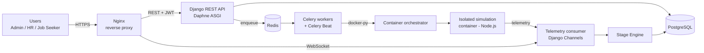

# RASP: Recruitment Attack Simulation Platform

A training platform that simulates multi-stage, recruitment-themed cyber attacks, so people can practise spotting them in a safe environment. Built as my capstone project at Al Akhawayn University (Spring 2026).

Most awareness tools treat recruitment threats as a single phishing click. RASP models the whole hiring lifecycle (application, screening, interview, technical assessment, onboarding) and measures where users notice an attack, where they hesitate and where they miss it.

> **Safety note:** RASP contains no working malware and never captures real credentials. Every phishing link, file and form is a simulated representation inside an isolated sandbox with no outbound internet access.

## Why this exists

Attackers exploit the trust built into hiring: fake job postings, malicious resume files, stolen or AI-generated identities, and booby-trapped technical interviews. Documented cases include the More_Eggs campaign (eSentire, 2024) and a North Korean IT worker hired through KnowBe4's process (KnowBe4, 2024). Research so far has mostly focused on detecting fraud automatically, not on training the people in the process.

## Features

- **Multi-stage scenarios.** Admins build scenarios of 2 to 5 stages (Application, Screening, Interview, Technical Assessment, Onboarding), each with 1 to 3 attack vectors.
- **Attack vector library.** Phishing links, malicious attachments, credential-harvesting forms, fake identities, geographic inconsistencies and urgency tactics, with pre-built templates. Every vector is tagged with a MITRE ATT&CK technique ID before a scenario can go live.
- **Isolated sandboxes.** Each session runs in its own Docker container (Node.js) on a bridge network with no outbound internet access and no database access.
- **Real-time telemetry.** Clicks, hovers, flags, downloads and form submissions stream over WebSockets to Django Channels.
- **Stage Engine.** Rule-based scoring from JSONB detection criteria: Detected (100), Partial (50) or Missed (0), with an optional time-pressure penalty. New attack types need new data, not new code.
- **Immediate feedback.** After each decision the user sees what they caught or missed, with the related MITRE technique.
- **Analytics.** Per-stage detection rates and time-to-detect, most-missed MITRE techniques, hesitation (dwell-time) analysis, a D3.js attack-path graph for admins, and a personal radar chart and stage trends for users.
- **Scenario versioning.** Editing a scenario increments its version. Sessions already in progress finish on the version they started with.
- **Role-based access.** Administrator, HR Personnel and Job Seeker roles enforced on every API endpoint.
- **Ethical guardrails.** A training-exercise warning must be acknowledged before any simulation starts.

## Architecture



| Layer | Technology |
|---|---|
| Frontend | React (Vite), Tailwind CSS, Axios, Recharts, D3.js |
| Backend | Python, Django, Django REST Framework, Django Channels, Daphne |
| Data | PostgreSQL (JSONB detection rules), Redis |
| Async | Celery, Celery Beat |
| Infrastructure | Docker, Docker Compose, Nginx, Azure VM, Let's Encrypt |
| Simulation sandboxes | Node.js containers, one per session |
| Testing | pytest-django, Locust |
| Security tooling | Trivy |

### Design decisions worth a look

- **JSONB for detection criteria** lets each attack vector define its own matching rules (click-based, timing-based, form-based) without dozens of nullable columns.
- **Port allocation** was first done by querying used ports, then with `SELECT FOR UPDATE`. Under load both were fragile, so the final version delegates it to the Docker daemon with `publish_all_ports=True`, which binds a free port atomically.
- **Pre-aggregated analytics.** One `AnalyticsMetric` row per stage, updated with atomic `F()` increments, so dashboards don't scan every action log. Averages are stored as sum plus count to avoid rounding drift.
- **Sandbox authentication.** Containers can't validate session cookies, so each session gets a short-lived container token used for the WebSocket connection.
- **Zombie cleanup.** A scheduled task runs every five minutes to remove abandoned or stuck containers.

## Security and privacy

- Passwords hashed with bcrypt (work factor 12). Short-lived JWT access tokens with refresh rotation.
- Rate limiting on login and registration, and self-registration as an admin is blocked.
- Session IDs are UUIDs to prevent enumeration. Users can only reach their own session container, and the container proxy refuses access until the ethical warning is acknowledged.
- **Data minimisation (GDPR Art. 5(1)(c)):** behavioural logs store only a session UUID and a role, never a name, email or IP. Credential-form values are discarded, and the WebSocket consumer rejects payloads containing credential-related keys.
- Django's built-in CSRF, XSS and SQL-injection protections are enabled and not bypassed.
- Server hardening: SSH key-only login, root login disabled, Azure NSG and UFW allowing only ports 22, 80 and 443.
- Container images scanned with Trivy. Upgrading the base images and Django brought both the frontend and backend to 0 critical findings, and containers run as non-root.

## Testing

- **pytest-django** suites covering authentication and rate limiting, RBAC, session lifecycle, scenario activation, container proxy access control, cleanup tasks, token handling, the Stage Engine scoring paths and the analytics endpoints.
- **Locust load test:** 50 concurrent users for 8 minutes, 5,182 requests. Average response times were 1.35 to 1.76 s per endpoint, but the 95th percentile was 3.2 to 5.4 s, above the 2 s target (see limitations).

## Quick start

> Adjust the commands below to match your repository layout.

```bash
git clone https://github.com/<your-username>/<repo-name>.git
cd <repo-name>
# set your own secrets in .env
docker compose up --build
```

Then open `http://localhost`. Sandbox scenario images need to be built or available locally before a scenario can be activated.

## Screenshots

| Scenario builder | Attack templates |
|---|---|
| .png) |  |

| Ethical warning | Live simulation and feedback |
|---|---|
|  |  |

## Known limitations

- The 95th-percentile latency under 50 users misses the 2 s target. The likely cause is Daphne running as a single process, and moving to Gunicorn with Uvicorn workers is the first planned fix.
- Attack vectors are currently web-based only.

## Roadmap

- Email-based attack vectors through a sandboxed internal mail server
- Adaptive difficulty recommendations from a user's history
- Video-interview simulation
- Multi-language support
- Integration with real applicant tracking systems

## Author

**Ahmed Taha Baitou**, BSc Computer Science, Al Akhawayn University.
Capstone supervised by Dr. Omar Iraqi Houssaini.
[LinkedIn]https://www.linkedin.com/in/ahmed-taha-b-86b524270/ · ahmedtahabaitou@gmail.com

## References

- eSentire (2024). *More_Eggs malware distributed via fake LinkedIn job offers.*
- KnowBe4 (2024). *KnowBe4 detects and thwarts actions of a state-sponsored insider threat actor.*
- Vidros et al. (2017). Automatic detection of online recruitment frauds. *Future Internet, 9*(1), 6.
- Mateo Sanguino (2026). Social engineering attacks using technical job interviews. *Information, 17*(1), 98.
- Checkr (2025). *Hiring hoax: Manager survey 2025.*
- FBI (2025). *North Korean IT worker threats to U.S. businesses.*
